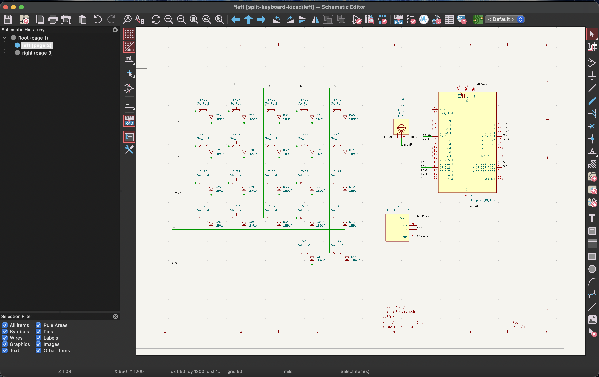
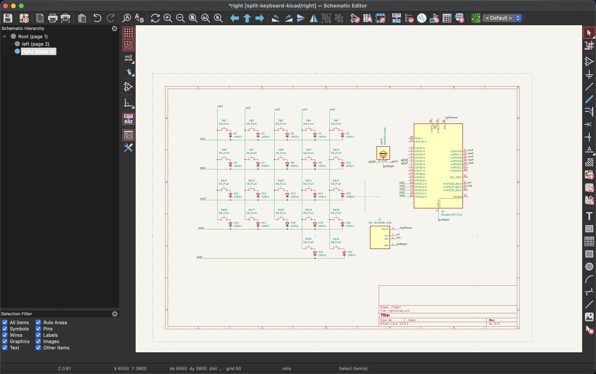
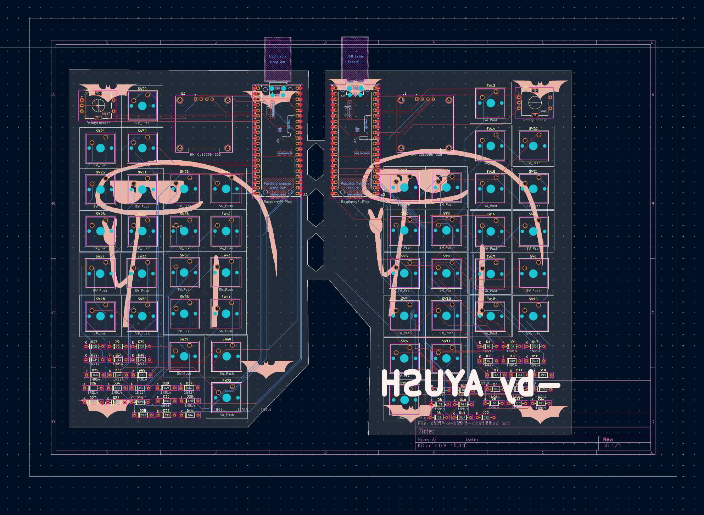
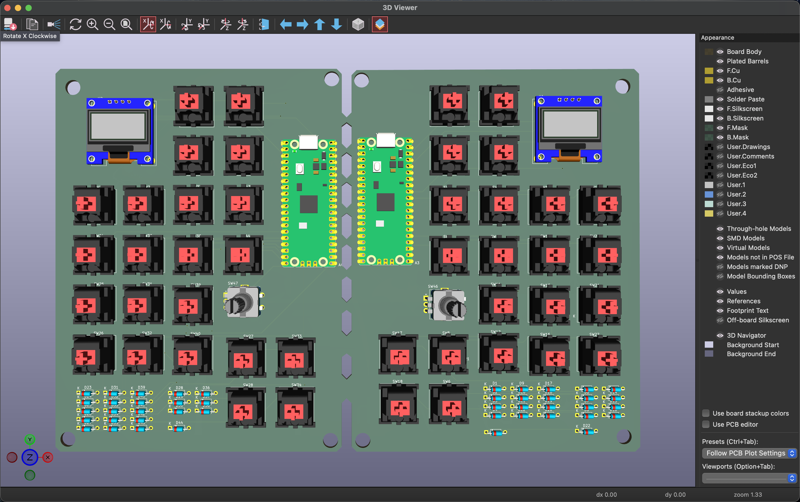
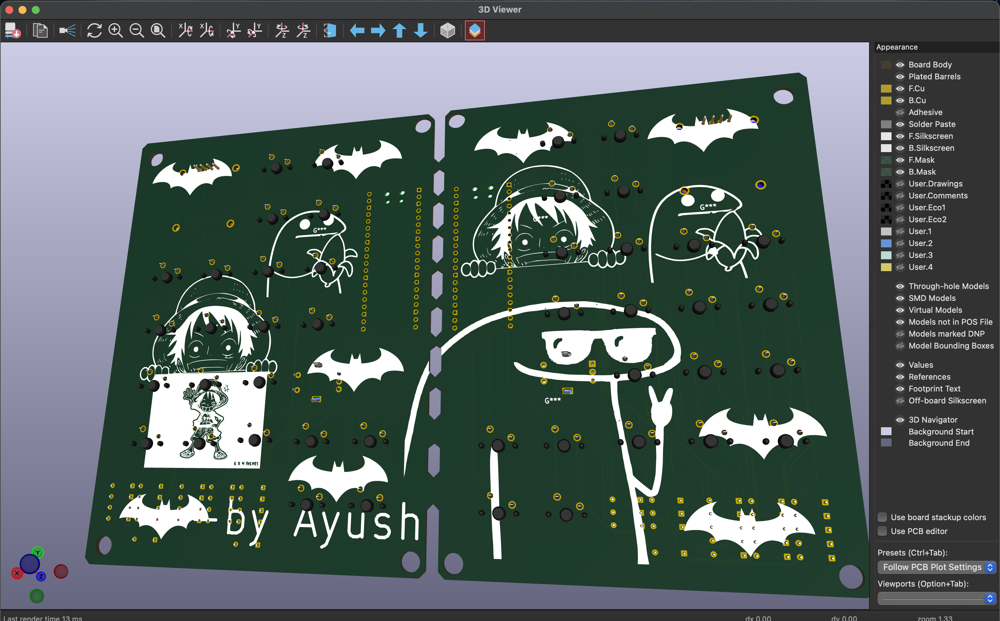
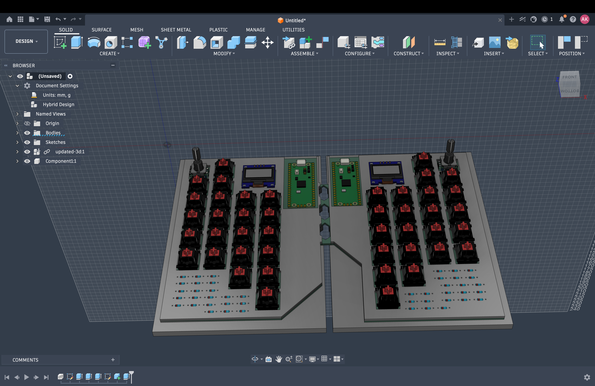
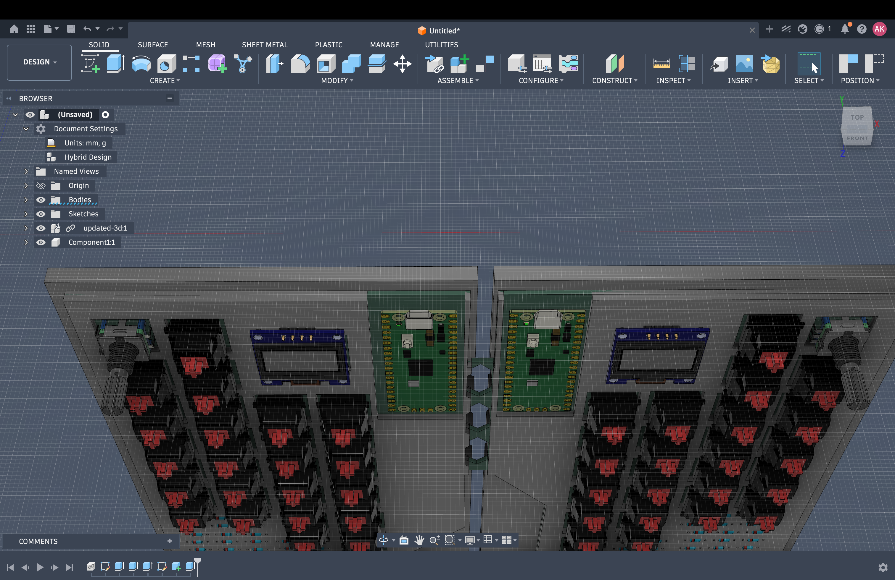
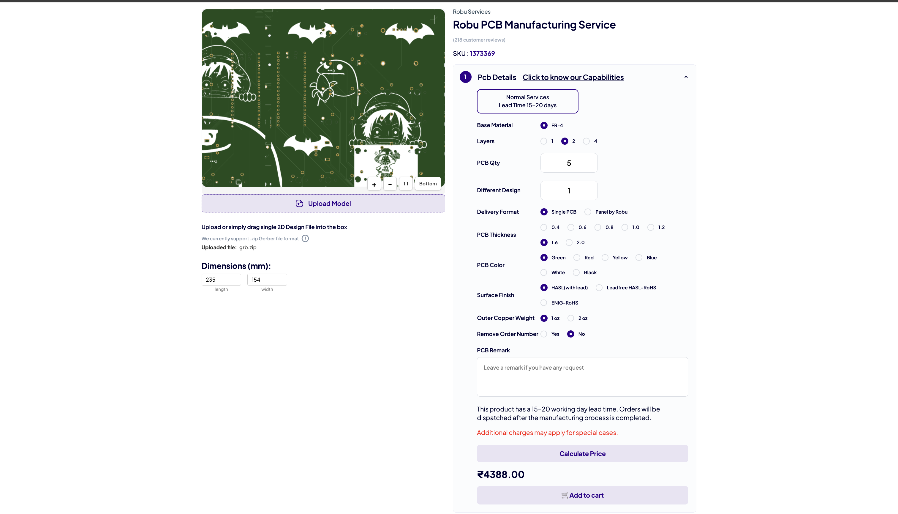
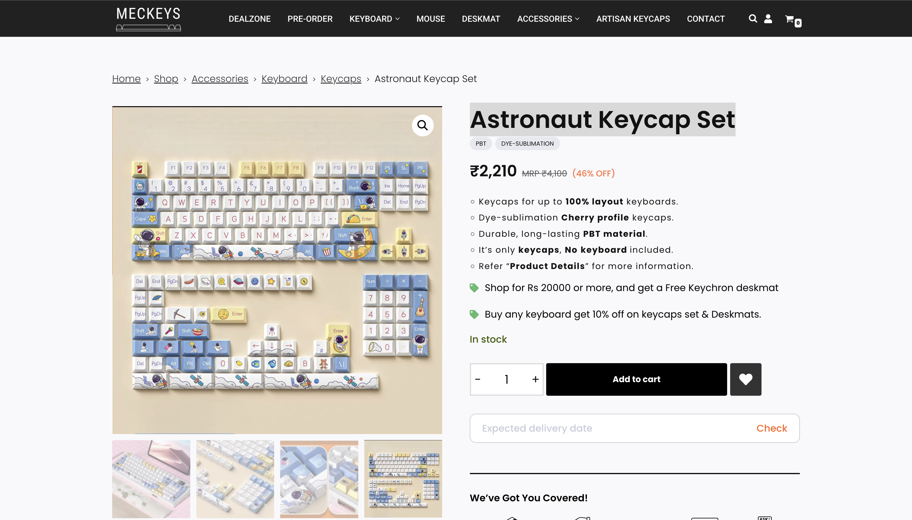
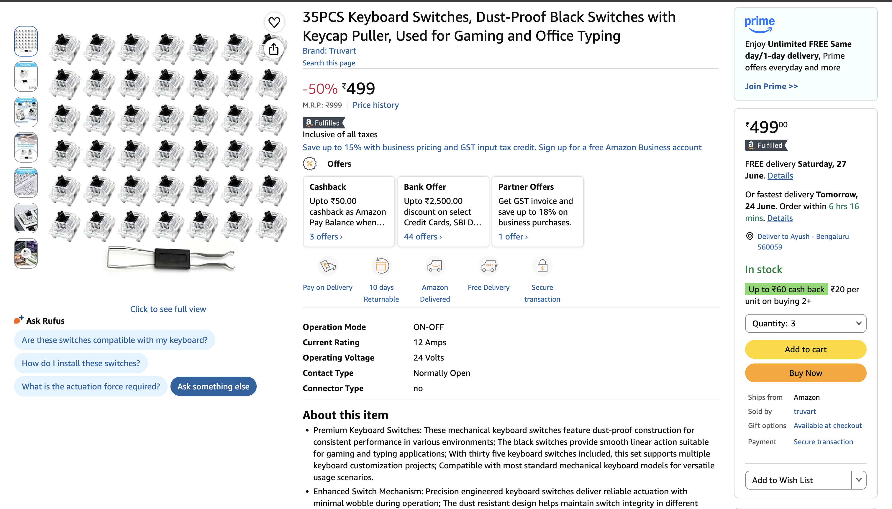

# Split Keyboard

Split keyboard created in kicad and cad

## What is this project

This is a split keyboard. It is divided into 2 parts.
I designed it to gain some experience in pcb design, cad modeling and firmware development.
It has 22 keys per side, oled display, and rotary encoder.

## Why I made it

I want to design my own keyboard to gain experience in hardware project.
I got a lot of useful information about creating schematics, pcb routing, footprints, cad case modeling and file structure on github.


## what is inside

- split keyboard pcb
- cad case 
- firmware file
- gerber files
- project images
- bom csv


## Images


### Schematic Left



### Schematic Right



### PCB Routing



### PCB 3D Front



### PCB 3D Back



### 3D 1



### 3D 2




### PCB Order



### Keycaps



### Cherry MX Switches




### Repository Organization

```text
split-keyboard/
│
├── README.md
├── split-keyboard-bom.csv
│
├── cad/
│   ├── assembled.f3z
│   ├── assembled.step
│   └── pcb3d[pcb only].step
│
├── grb/
│   ├── split-keyboard-kicad-B_Cu.gbr
│   ├── split-keyboard-kicad-B_Mask.gbr
│   ├── split-keyboard-kicad-B_Paste.gbr
│   ├── split-keyboard-kicad-B_Silkscreen.gbr
│   ├── split-keyboard-kicad-Edge_Cuts.gbr
│   ├── split-keyboard-kicad-F_Cu.gbr
│   ├── split-keyboard-kicad-F_Mask.gbr
│   ├── split-keyboard-kicad-F_Paste.gbr
│   ├── split-keyboard-kicad-F_Silkscreen.gbr
│   ├── split-keyboard-kicad-NPTH.drl
│   ├── split-keyboard-kicad-PTH.drl
│   └── split-keyboard-kicad-job.gbr

```

## Features

* split keyboard design
* 22 keys on each side
* oled display
* 2 rotary encoders
* custom pcb designed in kicad
* custom cad case
* raspberry pi pico controller
* firmware written in c++

## 3D Model

### Full Keyboard Assembly


IMAGE COMMING SOONN AFTER BUILD...

this is the complete 3d model of the split keyboard with all major components placed inside the design. the model was created to verify the fit of the pcb, switches, display, rotary encoders, and case before manufacturing.

## Firmware

the firmware files for this project are available in the `split_keyboard_firmware/` folder.

currently the firmware is still being developed and tested. basic project structure, display examples, and source files have already been added to the repository.


## build notes

- i used kicad for my schematics and PCB design
- i designed the keyboard case in cad
- i exported gerber files for manufacture
- i kept the design simple to make it easy to build and code


## BOM

| Name | Purpose | Quantity | Total Cost (USD) | Link | Distributor |
| --- | --- | ---: | ---: | --- | --- |
| raspberry pi pico board | devboard to code on | 2 | $8.11 | https://robu.in/product/raspberry-pi-pico/ | robu |
| rotary encoder | knob control | 2 | $4.00 | https://robu.in/product/hongyan-ec11h-7ce15p1zy15f7-rotary-encoder-with-push-button-switch-vertical-plug-in/ | robu |
| pcb | to soilder all things onn | 1 | $46.00 | https://robu.in/product/online-pcb-manufacturing-service/ | robu |
| keycaps | to put above mx keys which give more surface area to click the button | 1 | $22.00 | https://meckeys.com/shop/accessories/keyboard-accessories/keycaps/astronaut-keycap-set/ | meckeys |
| mx cherry keys | to make button works, it is the buttons to press | 44 | $17.00 | https://www.amazon.in/Keyboard-Switches-Dust-Proof-Keycap-Puller/dp/B0GZVJZP6V/ref=sr_1_1?crid=1EHWTYDETVJK0&dib=eyJ2IjoiMSJ9.EPKf_Chov9UdC52FZTZhqD9gxnQ2H53JUXcx-ExCRIuWW5M0qEhEaj_EA4Hh8svkmQaRo_iwuATTiiKnUm_249SRJG3SZchNICn6NqN_LnjG7vWbbi8DNZnYo_UyOs1PBskO9rMlKtHwcH0_-CwgYq2Hd9GEhnLxf2cab6ss66qjs4INdDIkbpSQtbI0jD_gbd9Xzn6TXAXXerfTdFoA0XUWCOw7caRT4xZMyWuczbQ.EnDgPv4DcOxBSh3BzIr-p_Og38qAgpwU2yX1HpgDfDA&dib_tag=se&keywords=cherry+mx+switches&nsdOptOutParam=true&qid=1782203293&sprefix=mx+cherry%2Caps%2C295&sr=8-1 | amazon |
| 1N4148 diodes | key matrix isolation | 44 | $3.00 | https://robu.in/product/diode-1n4148/ | robu |


## note

this project is still being worked on, and i will keep improving the case, layout, and code.
